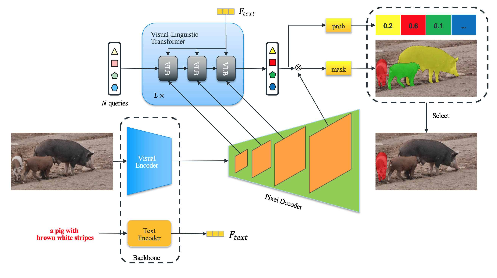

The official implementation of the paper:

<div align="center">
<h1>
<b>
VLFormer: Visual-Linguistic Transformer <br> for Referring Image Segmentation
</b>
</h1>
</div>
<p align="center">
  
</p>

## Abstract
``` Under review ```
<!-- The referring image segmentation task aims to segment a referred object from an image using a natural language expression. The query expression in referring image segmentation typically describes the relationship between the target object and others. Therefore, several objects may appear in the expression, and the model must carefully understand the language expression and select the correct object that the expression refers to. In this work, we introduce a unified and simple query-based framework named VLFormer. Concretely, we use a small set of object queries to represent candidate objects and design a mechanism to generate the fine-grained object queries by utilizing language and multi-scale vision information. More specifically, we propose a Visual-Linguistic Transformer Block, which produces a richer representation of the objects by associating visual and linguistic features with the object queries effectively and simultaneously. At the same time, we leverage the ability to extract linguistic features from CLIP, which has a great potential for compatibility with visual information. Without bells and whistles, our proposed method significantly outperforms the previous state-of-the-art methods by large margins on three referring image segmentation datasets: RefCOCO, RefCOCO+, and G-Ref. -->

## Demo
<p align="center">
  
</p>

## Main Results

Main results on RefCOCO

| Backbone | val | test A | test B |
| ---- |:-------------:| :-----:|:-----:|
| ResNet50 | 73.92 | 76.03 | 70.86 |
| ResNet101 | 74.67  |   76.8  | 70.42 |

Main results on RefCOCO+

| Backbone | val | test A | test B |
| ---- |:-------------:| :-----:|:-----:|
| ResNet50 | 64.02 | 69.74 | 55.04 |
| ResNet101 | 64.80 | 70.33 | 56.33 |

Main results on G-Ref

| Backbone | val | test |
| ---- |:-------------:| :-----:|
| ResNet50 | 65.69 | 65.90 |
| ResNet101 | 66.77 | 66.52|

## Update
``` update here ```
## Requirements
We test our work in the following environments, other versions may also be compatible:
- CUDA 11.1
- Python 3.8
- Pytorch 1.9.0

## Installation
Please refer to [installation.md](docs/installation.md) for installation

## Data preparation
Please refer to [data.md](docs/data.md) for data preparation.
## Training 
```
sh scripts/train.sh 
```
or 
```
python train_net_video.py --config-file <config-path> --num-gpus <?> OUTPUT_DIR <?>
```
for example, to train Resnet101-backbone model in RefCOCO dataset with 2 gpus:
```
python train_net_video.py --config-file configs/refcoco/VLFormer_R101_bs8_100k.yaml --num-gpus 2 OUTPUT_DIR output/refcoco-RN101
```

In terms of resuming the previous training, then add the flag ```--resume``` 

## Evaluation
```
python train_net_video.py --config-file <config-path> --num-gpus <?> --eval-only OUTPUT_DIR <output_dir> MODEL.WEIGHTS <weight_path>
```

